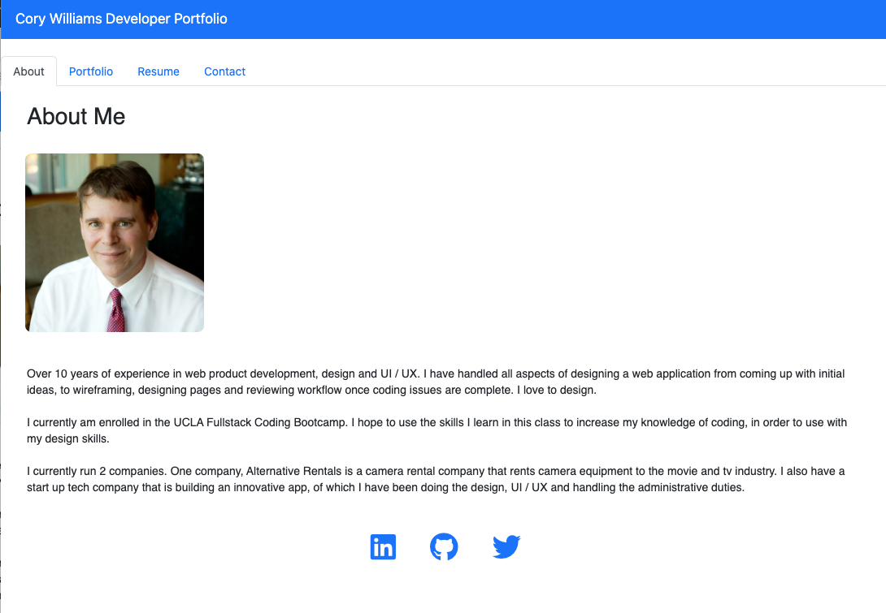

# My Portfolio

## Description

The application shows my portfolio.  It includes an about page which discusses a little about me.  There is a portfolio tab which lists some of my coding applications.  The resume tab highlights my work history.  The contact page allows someone to contact me.

## Functionality

This portfolio is created using React and is deployed to GitHub pages.  

This is a single-page application.  When it loads the viewer is presented with a page containg a header with tabs for content.  There are tabs for About Me, Portfolio, Resume and Contact.  When a user clicks on a tab they are presented with the corresponding section which is selected with with black test.

When a user loads the app for the first time they are presented with the About tab selected and a section about me that shows a photo and bio about myself.  

When the user select the Portfolio tab, they see images of some of my applications with links to the deployed applications.

When the user selects the Contact tab, they see a page with a contact form and fields for a name, email address and a message.  If they don't enter a proper emai address they receive a notification that the email address is invalid.  If they don't enter text in the name field they receive a notification that the name is required.  If they don't enter text in the message field they get a notification that a message is required.

When the user selects the Resumes tab, they see my resume which lists my past work history, including my experience and information learned in the Full-Stack Developer coding course.

## Code

The application uses `create-react-app` to build the portfolio, which includes the following:

* A `NavTabs` component that appears on multiple pages.

* Components for an About page, Contact page, Portfolio page and Resume page.

## Installation

The code for this project can be found on GitHub at: https://github.com/c-alanwill/cw-portfolio

The application is deployed to GitHub pages at: 

## Mock-Up

The following image show's the application's look:

## Credits

N/A

## License

Please refer to the license in the repo.

## Contributing

N/A